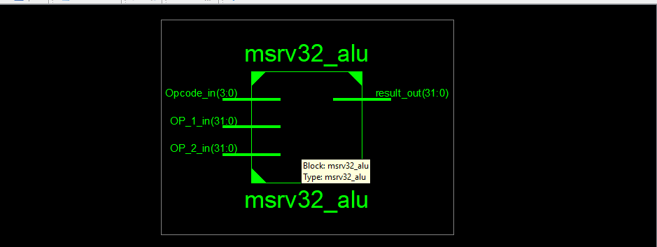
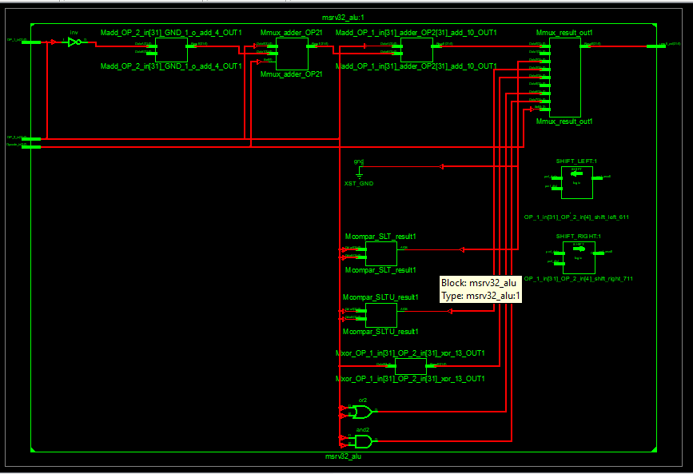
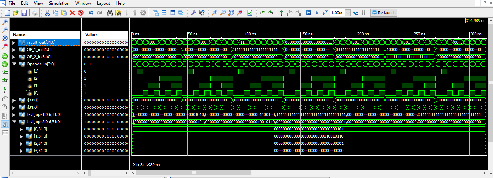

# MSRV32 ALU — 32-Bit RISC-V ALU in Verilog / Xilinx ISE


A **32-bit RISC-V-compatible Arithmetic Logic Unit (ALU)** designed in Verilog HDL and simulated using **Xilinx ISE**. This module (`msrv32_alu`) implements the full ALU operation set required by the **RV32I base integer instruction set**, including ADD/SUB, bitwise logic, shifts, and signed/unsigned comparisons — all driven by a compact 4-bit opcode.

---

## Table of Contents

- [Overview](#overview)
- [Features](#features)
- [Project Structure](#project-structure)
- [Port Description](#port-description)
- [Opcode Encoding](#opcode-encoding)
- [Internal Architecture](#internal-architecture)
- [Simulation Results](#simulation-results)
- [Getting Started](#getting-started)
- [How to Run](#how-to-run)
- [Testbench](#testbench)
- [Tools & Requirements](#tools--requirements)
- [RISC-V Compliance Note](#risc-v-compliance-note)
- [License](#license)

---

## Overview

`msrv32_alu` accepts two 32-bit operands and a 4-bit opcode to perform one of **8 operations** drawn directly from the RISC-V RV32I specification. The lower 3 bits of the opcode (`Opcode_in[2:0]`) select the operation; the MSB (`Opcode_in[3]`) distinguishes **ADD** from **SUB** — mirroring the `funct3`/`funct7` encoding of real RISC-V instructions.

The ADD/SUB path uses a **shared adder** with two's-complement negation, avoiding a redundant subtractor and minimising LUT usage. Shift amounts are correctly masked to 5 bits per the RV32I spec. Signed comparison (`SLT`) uses Verilog's `signed` qualifier for correct two's-complement semantics.

---

## Features

- ✅ **RISC-V RV32I–aligned** opcode encoding (`funct3` + SUB flag)
- ✅ **Shared ADD/SUB adder** — two's-complement negation, single adder path
- ✅ Signed (`SLT`) and unsigned (`SLTU`) set-less-than comparison
- ✅ Logical shifts: `SLL`, `SRL` with 5-bit masked shift amount per RV32I spec
- ✅ Full bitwise suite: `XOR`, `OR`, `AND`
- ✅ Purely combinational (`always @*`) — zero-latency, synthesis-friendly
- ✅ Verified via Xilinx ISE / ISim waveform simulation

---

## Project Structure

```
msrv32_alu/
├── msrv32_alu.v         # ALU top-level module
├── msrv32_alu_tb.v      # Testbench with test vector arrays
├── msrv32_alu.ucf       # User Constraints File (pin assignments)
├── msrv32_alu.xise      # Xilinx ISE project file
├── sim_waveform.png     # ISim simulation screenshot
└── README.md            # This file
```

---

## Port Description

| Port | Direction | Width | Description |
|------|-----------|-------|-------------|
| `OP_1_in` | Input | `[31:0]` | First operand (rs1) |
| `OP_2_in` | Input | `[31:0]` | Second operand (rs2 or immediate) |
| `Opcode_in` | Input | `[3:0]` | Operation selector — see encoding below |
| `result_out` | Output | `[31:0]` | Computed result |

---

## Opcode Encoding

The 4-bit opcode is split into two fields that mirror the RISC-V `funct3` / `funct7[5]` encoding:

```
 Opcode_in[3:0]
 ┌─────┬───────────┐
 │ [3] │  [2:0]    │
 │ SUB │  funct3   │
 └─────┴───────────┘
```

| `Opcode_in[3]` | `Opcode_in[2:0]` | Mnemonic | Operation |
|:--------------:|:----------------:|----------|-----------|
| `0` | `000` | **ADD**  | `OP_1 + OP_2` |
| `1` | `000` | **SUB**  | `OP_1 − OP_2` (shared adder, two's complement) |
| `x` | `001` | **SLL**  | `OP_1 << OP_2[4:0]` — logical shift left |
| `x` | `010` | **SLT**  | `(signed) OP_1 < (signed) OP_2 ? 1 : 0` |
| `x` | `011` | **SLTU** | `OP_1 < OP_2 ? 1 : 0` (unsigned) |
| `x` | `100` | **XOR**  | `OP_1 ^ OP_2` |
| `x` | `101` | **SRL**  | `OP_1 >> OP_2[4:0]` — logical shift right |
| `x` | `110` | **OR**   | `OP_1 \| OP_2` |
| `x` | `111` | **AND**  | `OP_1 & OP_2` |

> `x` = don't care. `Opcode_in[3]` only affects the result when `Opcode_in[2:0] == 3'b000`.

---

## Internal Architecture

```
      OP_1_in [31:0]              OP_2_in [31:0]
           │                           │
           │            Opcode[3] ─────┤
           │                 │         ▼
           │            ┌─────────────────────┐
           │            │  Negate if SUB:     │
           │            │  ~OP_2 + 1          │──── adder_OP2
           │            └─────────────────────┘         │
           │                                            │
           ├──────────────────────────────── ADD / SUB ─┤
           │                                            │
           ├──── SLL  (OP_1 << OP_2[4:0]) ─────────────┤
           │                                            │
           ├──── SRL  (OP_1 >> OP_2[4:0]) ─────────────┤
           │                                            │
           ├──── SLT  (signed_OP1 < signed_OP2) ────────┤     ┌──────────────┐
           │                                            ├────▶│ result_out   │
           ├──── SLTU (OP_1_in  < OP_2_in) ────────────┤     │  [31:0]      │
           │                                            │     └──────────────┘
           ├──── XOR ───────────────────────────────────┤
           │                                            │
           ├──── OR  ───────────────────────────────────┤
           │                                            │
           └──── AND ───────────────────────────────────┘
                               ▲
                    Opcode_in[2:0]  selects via case()
```

**Key design decisions:**

| Decision | Rationale |
|----------|-----------|
| Shared adder for ADD/SUB | `adder_OP2` mux eliminates a separate subtractor; saves logic resources |
| `OP_2_in[4:0]` shift mask | Caps shift amount at 31 — required by RV32I; prevents undefined behaviour |
| `wire signed` for SLT | Forces Verilog arithmetic comparison; no manual sign-bit extraction needed |
| `always @*` combinational | Zero register latency; plugs cleanly into a pipelined EX stage |

---

## Simulation Results

Simulated in **Xilinx ISim** across a **~315 ns** window using a testbench with array-driven inputs (`test_ops1[0:6]`, `test_ops2[0:6]`) swept via nested `i`/`j` loop counters.

| Signal | Observation |
|--------|-------------|
| `Opcode_in[3:0]` | Sweeps all values; `0111` (AND) active at end of trace |
| `Opcode_in[3]` | Toggles correctly to distinguish ADD vs SUB |
| `OP_1_in / OP_2_in` | Driven from test vector arrays; zero and patterned values confirmed |
| `result_out` | Correctly tracks opcode — zero output for AND of zero operands, non-zero for set patterns |
| `test_ops2[0..3]` | Sub-vectors show `101`, `100110`, `1`, `0` — matching expected results |

### Waveform Screenshot




> *ISim waveform showing `result_out`, operands, `Opcode_in` bit breakdown, and test array sub-elements across 315 ns.*

---

## Getting Started

### Prerequisites

- [Xilinx ISE Design Suite 14.7](https://www.xilinx.com/support/download/index.html/content/xilinx/en/downloadNav/vivado-design-tools/archive-ise.html)
- ISim (bundled with ISE) for behavioural simulation

### Clone

```bash
git clone https://github.com/yourusername/msrv32-alu.git
cd msrv32-alu
```

---

## How to Run

### Xilinx ISE (GUI)

1. Open **Xilinx ISE Project Navigator**.
2. **File → Open Project** → select `msrv32_alu.xise`.
3. In the **Design** panel, set `msrv32_alu_tb` as the top-level simulation module.
4. **Processes → ISim Simulator → Simulate Behavioral Model** (double-click).
5. ISim launches — zoom and scroll the waveform to inspect each operation.

### Command Line (ISim)

```bash
# Compile design and testbench
vlogcomp msrv32_alu.v msrv32_alu_tb.v

# Elaborate
fuse work.msrv32_alu_tb -o sim.exe

# Run simulation
./sim.exe -tclbatch run.tcl
```

`run.tcl`:
```tcl
run 400ns
quit
```

---

## Tools & Requirements

| Tool | Version | Purpose |
|------|---------|---------|
| Xilinx ISE | 14.7 | Synthesis, place & route |
| ISim | Built-in | Behavioural simulation |
| Verilog HDL | IEEE 1364-2001 | RTL design language |

---

## RISC-V Compliance Note

This ALU implements the computational core of the **RV32I base integer ISA**. It is designed to slot into a larger RISC-V pipeline (`msrv32`) as the execution-stage ALU. It does not include:

- Program counter or branch resolution logic
- Register file or data memory interface
- Instruction fetch / decode / control unit


---

*Part of the `msrv32` RISC-V softcore project — a ground-up RV32I CPU implementation in Verilog.*
